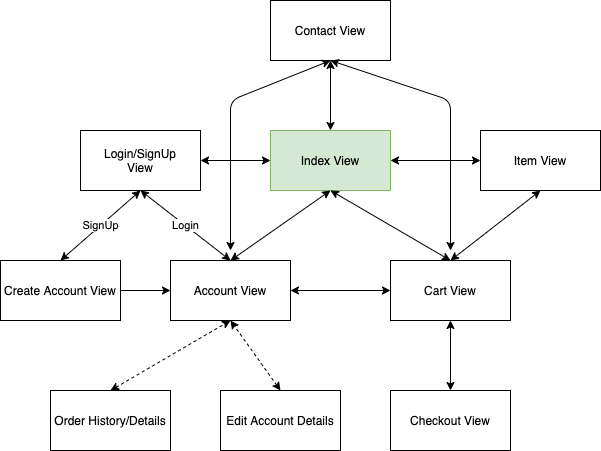
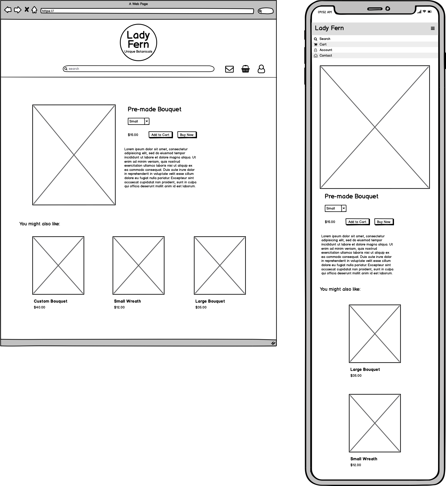
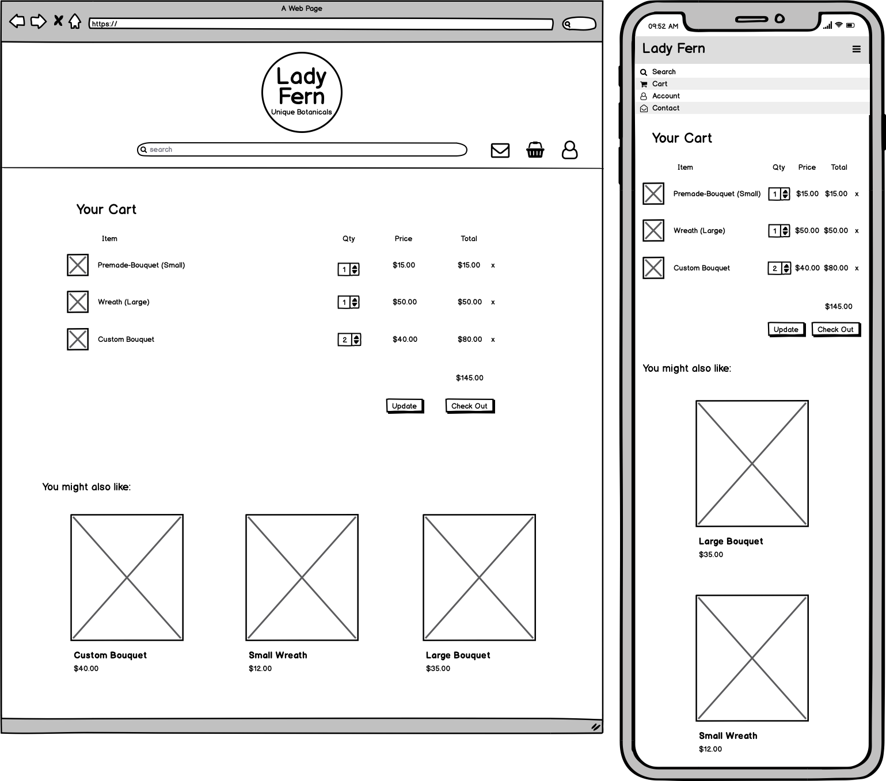
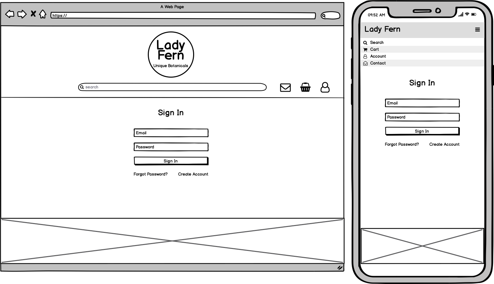
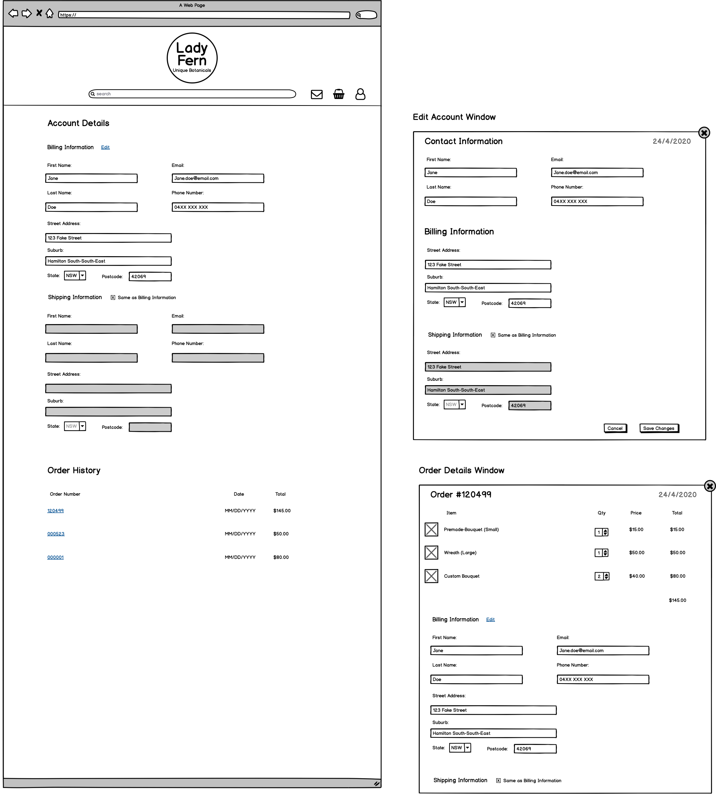
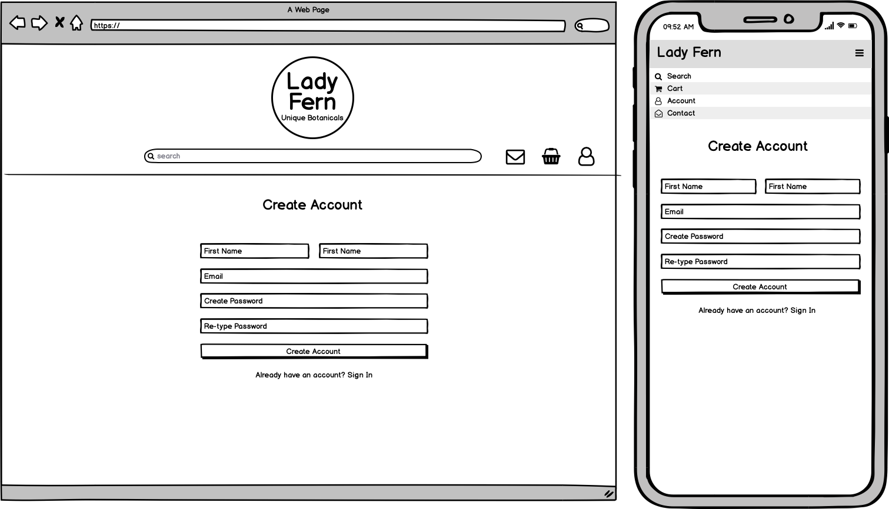
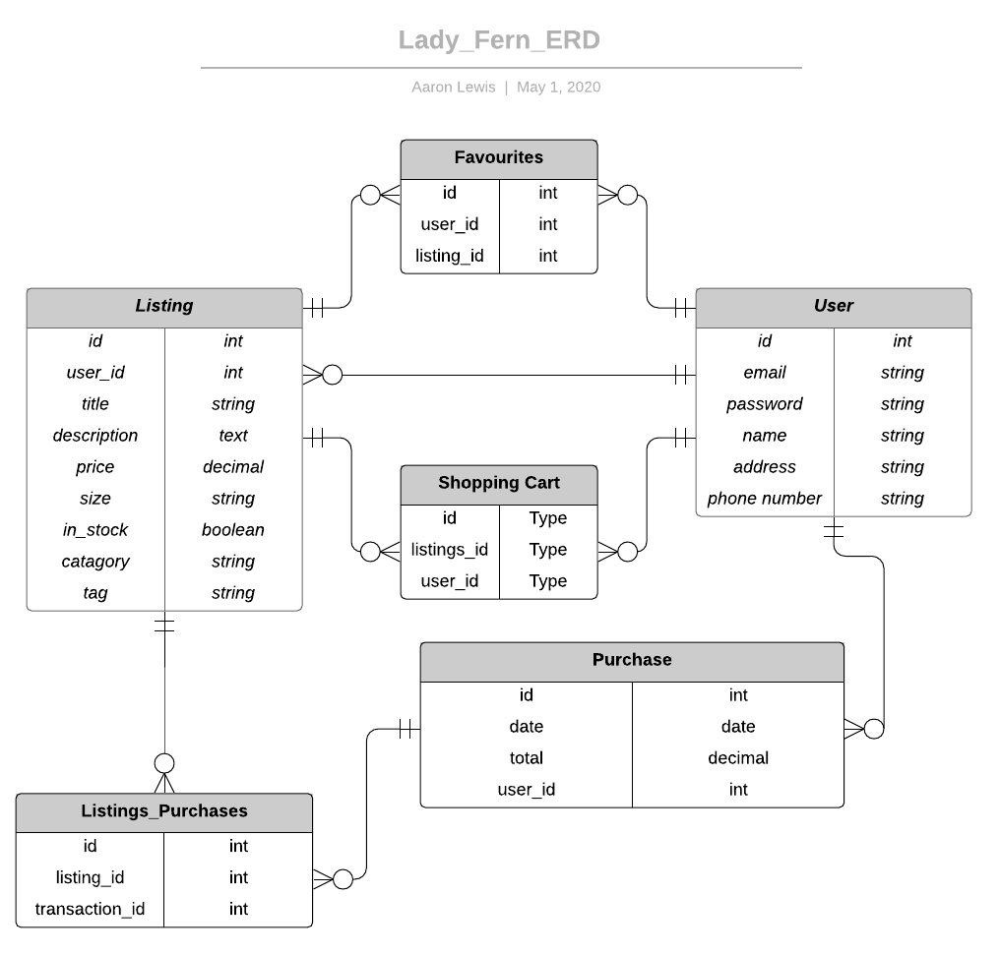

# The Lady Fern - Florist Marketplace

This e-commerce web application is being developed for a local florist in order to boost their sales during the COVID-19 isolation period and beyond. With the strict social distancing rules set in place, this business owner is finding it difficult to continue regular operations as local markets and gatherings are no longer allowed to take place.

Global economy has been affected by this pandemic, and small business are finding it challenging to stay afloat. With the implementation of an online platform for selling goods, this allows businesses to continue to sustain themselves, whilst also driving the economy and potentially pulling the country futher towards an economic upturn.

## Relevant Links

### Website

http://lady-fern.herokuapp.com/

### Github Repository

https://github.com/AaronL1011/The_Lady_Fern

## Planning and Development

### Functionality and Features

This website is being designed as an e-commerce application for a local business, so obviously it needs to be able to handle the creation, retrieval, updating and deletion of listings as well as functionality for transactions and order processing. This means I will need to write CRUD methods for listings, and implement a third-party payment solution such as Stripe.

I plan to include user accounts in order to control role permissions and authentication, and attach each transaction to the corresponding user. I will achieve this with the Devise gem, as it has inbuilt CRUD functions and authentication methods.

Some extra features I would like to implement:
- Search Bar
- Admin Dashboard for controlling all listings/users
- Shopping Cart for multiple listings in one purchase

### Site Map

### Screenshots

### Target Audience

The target audience for this application is limited to residents of the local Newcastle, NSW area due to the project being developed for a local business that only provides local flower delivery. As a developer I must ensure the website is appropriate for all ages and meets the requirements for any customers who want to purchase listings from the website. 

### Tech Stack

- HTML5
- CSS3
- SCSS
- JS
- JQuery
- Ruby on Rails
- Puma
- Heroku

### User Stories

**As a seller**, I would like to be able to create listings and accept payment on this marketplace so I can recieve money in exchange for my goods.

**As a buyer**, I would like to be able to see all available listings on the marketplace so I can purchase the listings that I like.

**As a seller**, I would like to be able to mark listings as out of stock, so I can prevent purchases for unavailable items.

**As a buyer**, I would like to be able to see a history of purchases that I have made so I have proof of purchase.

**As a business owner**, I would like the marketplace website to reflect the overall aesthetic of my business.

**As a buyer**, I would like to be able to see a customers shipping address information so I know where to send the purchased goods.

**As a buyer**, I would like to be able to search for particular listings so I don't have to dig through all the current listings.

**As a user**, I would like to be able to update my user information if any details change.

**As an admin user**, I would like to be able to control the stock status of listings, as well as edit and delete listings so I can keep the current listings up to date.

### Wireframes

**Landing Page**
This page should include the most useful information. I plan to include a cross-page header/navigation bar. A short blurb about the company, a showcase-carousel for displaying listing categories, and all the current available listings.

**Item Show View**
This view is where all information on a listing is available, as well as buttons for Buy Now and adding the item to the users cart. Below the listing, I want to include some suggested items to encourage more purchases from the user.

**Cart View**
Pretty straight forward, this is the shopping cart view where the user can adjust item quantities and checkout. Ill have to figure out a way to make it look nice on mobile with the amount of information I'm displaying. I think I will include the same suggested items idea below the cart aswell as the item listings.

**Sign In View**
This is where users can sign in, or reset passwords/create accounts.

**Account View**
This is where the user will see their account information, as well as ways to edit their information. I don't think I will be able to include all of this information within the assignement timeframe, so I may have to keep it barebones if I want to include the other features planned.

**Create Account View**
A form to register a new user account, with fields for Name, Email, Password, Addresses and a profile picture upload.

## Entity Relationship Diagram

