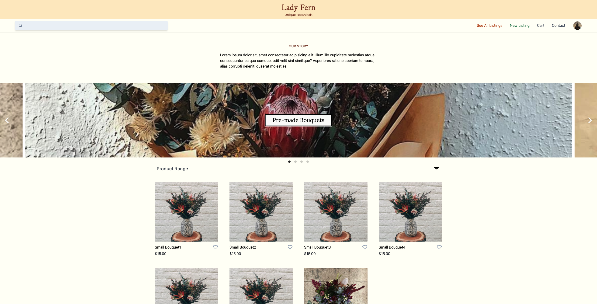
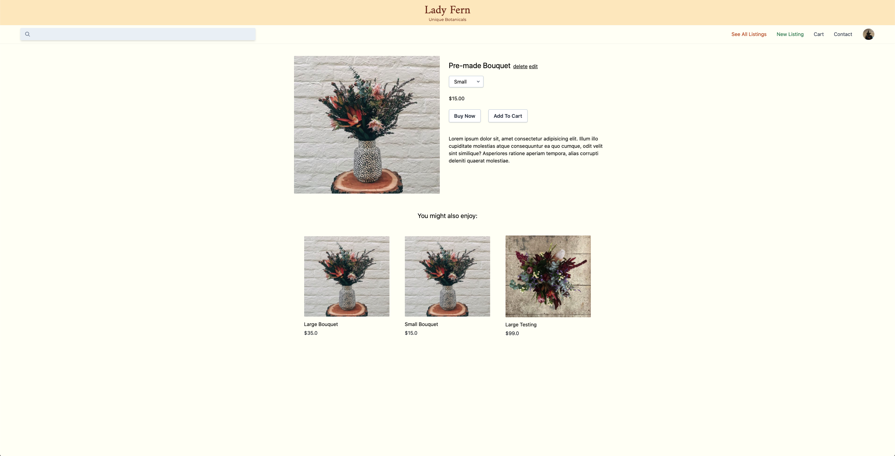
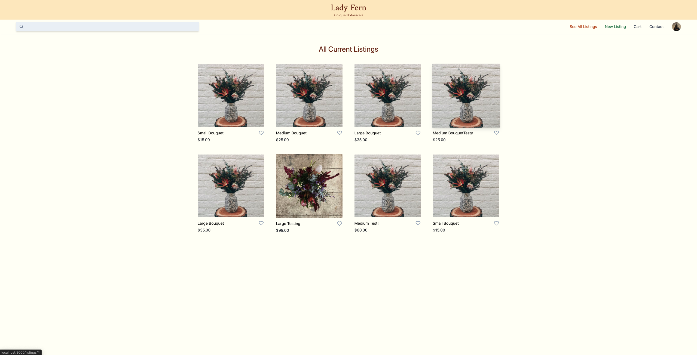
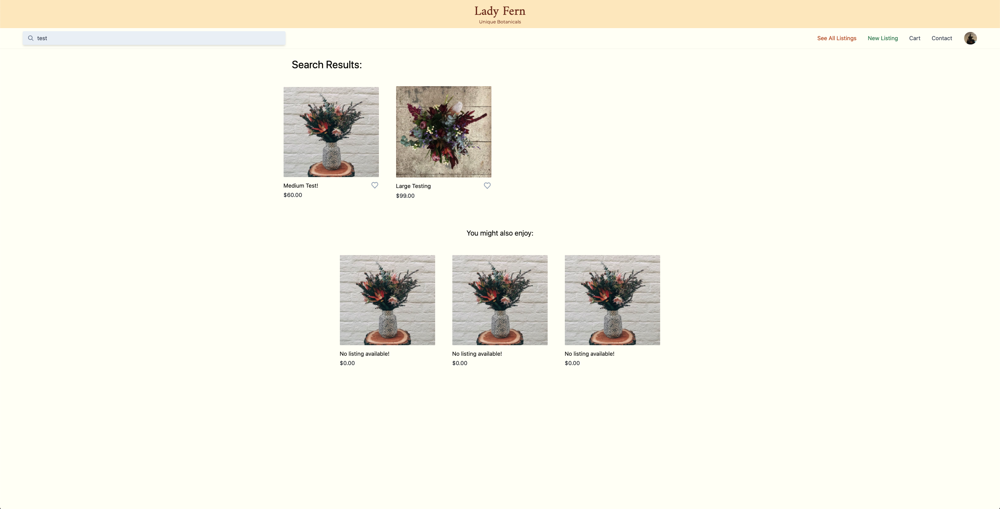

# The Lady Fern - Florist Marketplace

This e-commerce web application is being developed for a local florist in order to boost their sales during the COVID-19 isolation period and beyond. With the strict social distancing rules set in place, this business owner is finding it difficult to continue regular operations as local markets and gatherings are no longer allowed to take place.

Global economy has been affected by this pandemic, and small business are finding it challenging to stay afloat. With the implementation of an online platform for selling goods, this allows businesses to continue to sustain themselves, whilst also driving the economy and potentially pulling the country futher towards an economic upturn.

## Relevant Links

### Website

http://lady-fern.herokuapp.com/

### Github Repository

https://github.com/AaronL1011/The_Lady_Fern

## Planning and Development

### Functionality and Features

### Site Map

### Screenshots

**Home Page**

**Item View**

**All Listings**

**Search Listings**

### Target Audience

The target audience for this application is limited to residents of the local Newcastle, NSW area due to the project being developed for a local business that only provides local flower delivery. As a developer I must ensure the website is appropriate for all ages and meets the requirements for any customers who want to purchase listings from the website. 

### Tech Stack

- HTML5
- CSS3
- SCSS
- JS
- JQuery
- Ruby on Rails
- Puma
- Heroku

### User Stories

**As a seller**, I would like to be able to create listings and accept payment on this marketplace so I can recieve money in exchange for my goods.

**As a buyer**, I would like to be able to see all available listings on the marketplace so I can purchase the listings that I like.

**As a seller**, I would like to be able to mark listings as out of stock, so I can prevent purchases for unavailable items.

**As a buyer**, I would like to be able to see a history of purchases that I have made so I have proof of purchase.

**As a business owner**, I would like the marketplace website to reflect the overall aesthetic of my business.

**As a buyer**, I would like to be able to see a customers shipping address information so I know where to send the purchased goods.

**As a buyer**, I would like to be able to search for particular listings so I don't have to dig through all the current listings.

**As a user**, I would like to be able to update my user information if any details change.

**As an admin user**, I would like to be able to control the stock status of listings, as well as edit and delete listings so I can keep the current listings up to date.

### Wireframes

**Landing Page**

**Item Show View**

**Cart View**

**Sign In View**

**Account View**

**Create Account View**

## Entity Relationship Diagram

