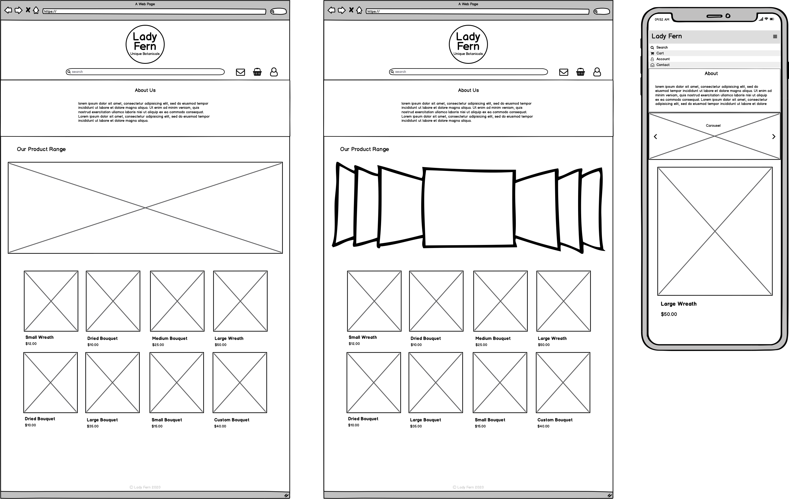

# The Lady Fern - Florist Marketplace

This e-commerce web application is being developed for a local florist in order to boost their sales during the COVID-19 isolation period and beyond. With the strict social distancing rules set in place, this business owner is finding it difficult to continue regular operations as local markets and gatherings are no longer allowed to take place.

Global economy has been affected by this pandemic, and small business are finding it challenging to stay afloat. With the implementation of an online platform for selling goods, this allows businesses to continue to sustain themselves, whilst also driving the economy and potentially pulling the country futher towards an economic upturn.

## Relevant Links

### Website

http://lady-fern.herokuapp.com/

### Github Repository

https://github.com/AaronL1011/The_Lady_Fern

## Planning and Development

### Functionality and Features

This website is being designed as an e-commerce application for a local business, so obviously it needs to be able to handle the creation, retrieval, updating and deletion of listings as well as functionality for transactions and order processing. This means I will need to write CRUD methods for listings, and implement a third-party payment solution such as Stripe.

I plan to include user accounts in order to control role permissions and authentication, and attach each transaction to the corresponding user. I will achieve this with the Devise gem, as it has inbuilt CRUD functions and authentication methods.

Some extra features I would like to implement:
- Search Bar
- Admin Dashboard for controlling all listings/users
- Shopping Cart for multiple listings in one purchase

### Site Map

### Screenshots

### Target Audience

The target audience for this application is limited to residents of the local Newcastle, NSW area due to the project being developed for a local business that only provides local flower delivery. As a developer I must ensure the website is appropriate for all ages and meets the requirements for any customers who want to purchase listings from the website. 

### Tech Stack

- HTML5
- CSS3
- TailwindCSS
- SCSS
- JS
- JQuery
- Ruby on Rails
- Puma
- Heroku

### User Stories

**As a seller**, I would like to be able to create listings and accept payment on this marketplace so I can recieve money in exchange for my goods.

**As a buyer**, I would like to be able to see all available listings on the marketplace so I can purchase the listings that I like.

**As a seller**, I would like to be able to mark listings as out of stock, so I can prevent purchases for unavailable items.

**As a buyer**, I would like to be able to see a history of purchases that I have made so I have proof of purchase.

**As a business owner**, I would like the marketplace website to reflect the overall aesthetic of my business.

**As a buyer**, I would like to be able to see a customers shipping address information so I know where to send the purchased goods.

**As a buyer**, I would like to be able to search for particular listings so I don't have to dig through all the current listings.

**As a user**, I would like to be able to update my user information if any details change.

**As an admin user**, I would like to be able to control the stock status of listings, as well as edit and delete listings so I can keep the current listings up to date.

### Wireframes

**Landing Page**
This page should include the most useful information. I plan to include a cross-page header/navigation bar. A short blurb about the company, a showcase-carousel for displaying listing categories, and all the current available listings.

**Item Show View**
This view is where all information on a listing is available, as well as buttons for Buy Now and adding the item to the users cart. Below the listing, I want to include some suggested items to encourage more purchases from the user.

**Cart View**
Pretty straight forward, this is the shopping cart view where the user can adjust item quantities and checkout. Ill have to figure out a way to make it look nice on mobile with the amount of information I'm displaying. I think I will include the same suggested items idea below the cart aswell as the item listings.

**Sign In View**
This is where users can sign in, or reset passwords/create accounts.

**Account View**
This is where the user will see their account information, as well as ways to edit their information. I don't think I will be able to include all of this information within the assignement timeframe, so I may have to keep it barebones if I want to include the other features planned.

**Create Account View**
A form to register a new user account, with fields for Name, Email, Password, Addresses and a profile picture upload.

## Entity Relationship Diagram

### Abstractions

The general structure of this marketplace application is fairly straight forward. You have users buying/selling listings, the ability to favourite listings, add listings to a cart, as well having a history of purchases.

High level components required for this application include models for:
- Users: holding customer information.
- Listings: holding item information.
- Carts: holding listings for a users cart.
- Favourites: marking listings as a users favourite.
- Listings_Purchases: holding listings for each.
- Purchases: holding purchase history for a user.

Third Party services are also required such as:
- Devise: User account creation and authentication.
- Stripe: Transaction processing and encryption.
- TailwindCSS: highly customizable, low-level CSS framework for website styling.
- Flickity: An all in one responsive carousel package.

### Third Party Services

- Heroku

This rails application has been deployed via GitHub and Heroku. Heroku is a Cloud PaaS (Platform as a Service) solution for the hosting of web applications. Along with its heavy integration with GitHub, this makes for fast and simple deployment.

- Amazon S3

Due to my application have a plethora of images attached (user profile pictures, listing images, etc), I required a storage solution so I didnt have to hold all the image data locally. Amazon S3 has a great free tier, and offers fairly seamless rails integration, so this was an easy choice to store my images.

- Stripe API

Handling payment information comes with its own set of challenges, security being the top priority. As I am still a budding developer, I don't feel confident handling the safe processing of transaction details myself. Enter Stripe API, an all in one RESTful third-party payment solution. This made taking peoples money a breeze! As a bonus, it handles all the appropriate encryption on its own!

- Devise

As previously mentioned, Devise is a handy Ruby Gem that handles User accounts and authentication! Using this service, I can assign roles and permissions, as well as create update and destroy user accounts. If I add a few of my own fields to the model, I should be able to make great use of this gem.

- TailwindCSS

Tailwind is a highly customizable low-level CSS framework that allows more freedom than a traditional framework like Bootstrap. It also makes it quite simple to create nicely responsive website components from scratch.

### Active Record Model Relationships

All of these relationships are visualized in my Entitity Relationship Diagram.

- **Users**: Users will be used to hold all the information for a customer of the website and any admin roles for staff. Users will have many Listings, Carts, Favourites and Purchases. Users will have a picture attached.

- **Listing**: Listing will hold all the information for each item to be sold. Listing belongs to User and has many Carts, Favourites and Purchases. Listings have a picture attached and validate for a Title, Description and Price. Listings will be destroyed if the User parent is destroyed.

- **Cart**: A cart component is required to hold each listing in a users cart in any given session. Carts belong to Users and Listings. Cart objects will be destroyed if their parent User is deleted.

- **Favourites**: The Favourite object is used to hold each listing that a User selects as a favourite. Favourites belong to Users and Listings. A favourite row will stay persistent until the User removes it, or the User account is destroyed.

- **Purchases**: This object is used to store listing information for each successful transaction. This allows the application to have a record of each users past transactions. Purchases belong to Users, and have many listings through listings_purchases. Purchase objects are destroyed if their parent User is destroyed.

- **Listings_Purchases**: This is a join table for use with the Purchases object. It allows for the storage of multiple listing objects in a single Purchase object. It belongs to Listing and Purchases, and is destroyed along with its parents.

- **Active Record Blob**: This is used to attach pictures to Listings and Users. Users have one Picture attached, Listings have one Picture attached.

### Project Planning and Tracking

In order to track the development of my application, I made use of a Trello Kanban board. This allowed me to create cards for each task and order them in columns for easy progress management.

